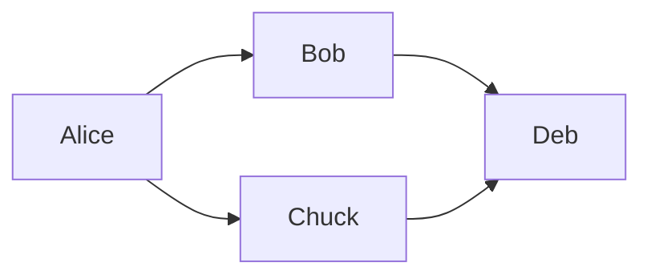

Markdown is a filter which renders [Markdown](https://en.wikipedia.org/wiki/Markdown) to HTML. 
It optionally styles it by enclosing into a ``<div class="markdown-body">`` recognized by [github-markdown-css](https://github.com/sindresorhus/github-markdown-css).

The filter also processes markdown which allows to embed diagrams using [fenced code blocks](https://www.markdownguide.org/extended-syntax/#fenced-code-blocks).

Markdown source can be defined in the YAML definition or loaded from an external resource.

[TOC levels=6]

## Inline Markdown

### Single line

```yaml
content-markdown:
  style: true
  source:
    content-text: Hello, *World*!
```

### Multi-line

```yaml
content-markdown:
  style: true
  source:
    content-text: |+2
      Hello, ``Universe``!
```

## Markdown loaded from resource

```yaml
content-markdown:
  style: true
  source:
    content-resource: features/execution-model.md  
```

## Embedded images

Markdown filter allows to embed PNG and JPEG using fenced blocks.

### PNG resource

	```png-resource
	nasdanika-logo.png
	```

Resource location is resolved relative to the model resource containing filter definition.
If the filter model element has a marker, e.g. it was loaded from YAML, then the resource location is resolved to the location of that YAML file
even if the model was saved to, say, XML after that.  

```png-resource
nasdanika-logo.png
```

### JPEG resource

	```jpeg-resource
	my.jpeg
	```

### PNG

	```png
	Base 64 encoded png 
	```
### JPEG

	```jpeg
	Base 64 encoded jpeg
	```

## Embedded diagrams

Markdown filter allows to embed [Draw.io](https://www.diagrams.net/) and [Mermaid](https://mermaid-js.github.io/mermaid/#/) diagrams using fenced blocks. Draw.io diagrams can be edited in a desktop editor or [Online editor](https://app.diagrams.net/).

### Draw.io

    ```drawio-resource
    aws.drawio
    ```

Resource location is resolved in the same way as for image files as explained above.

```drawio-resource
aws.drawio
```

### Mermaid

You can define [Mermaid](https://mermaid-js.github.io/mermaid/#/) diagrams in ``mermaid`` fenced blocks:

  ```mermaid
  flowchart LR
     Alice --> Bob & Chuck --> Deb
  ```

results in this diagram:



#### Loading from a resource

It is also possible to load a diagram definition from a resource resolved relative to the model resource:

    ```mermaid-resource
    sequence.mermaid
    ```


## Extensions

* [Table of contents](https://github.com/vsch/flexmark-java/wiki/Table-of-Contents-Extension) - add ``[TOC]`` to the document as explained in the documentation. This extension will create a table of contents from markdown headers. 
* [Footnotes](https://github.com/vsch/flexmark-java/wiki/Footnotes-Extension)
* Strikethrough: ``~~strikethrough~~``-> ~~strikethrough~~ 
* Subscript: ``H~2~O`` -> H~2~0
* Superscript: ``2^5^ = 32`` -> 2^5^ = 32
